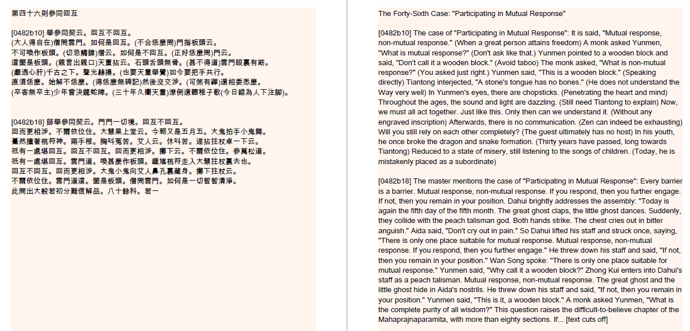

# ZenTranslatenator

This is an ancient Chinese Zen text into side-by-side translated PDF generator.

Installation Instructions:

1. It is vital that you download this font: https://www.download-free-fonts.com/details/88978/arial-unicode-ms
2. Install it by double clicking it and installing it or by putting it into your C:\Windows\Fonts directory.
3. Download the Zip File from releases (It's somewhere to your right. Don't be intimidate by all the other stuff on this Website. Deep breath.)
4. Install the program
5. It will launch on its own after installing. If you want to start it after, just type "Zentranslatenator" into your Windows search bar and it'll show up.

Usage Instructions: 

1. Paste your Chinese text (It can be as massive as you want, go nuts, put the Blue Cliff Record in there!).
2. Press "Chunkify the text".
3. Watch the incredible Enso animation.
4. Check out the text window below. Your text was conveniently split up into pages for you. It doesn't care about any kind of meaningul splitting up of the text, so if you want a nice PDF you have to make sure to check out all the chunks and edit them wherever you feel is a need to. (I might fix up a solution to make the chunk generator better later, but don't hold your breath).
5. Give a description of your text in the text box on the top right.
6. Edit the instructions for the translator AI to your liking.
7. Pick the folder the PDF should be put into. Defaults to C:\ZenPDFs\translatenatedPDF.pdf (If you make multiples with the same filename don't worry, it won't overwrite, it'll just add a number to the filename).
8. Pick a ChatGPT Version to use. I recommend version 4, but it will cost you more and generating will take longer.
9. Enter your OpenAI API key.
10. Press Translate (WARNING: THIS WILL COST YOU MONEY).
11. Watch the magnificent Enso animation. When it stops, your translation is ready. Check that folder. Yeah, I won't open it for you.

It works for me. That's about all I can say. No error handling. It eats money. It's badly tested. You're on your own.

Please give me feedback on the reddit forums, I'm /u/dota2nub. I'll work to improve this if there is some kind of engagement and people want this.

Screenshots to check out: 

This is what the program looks like:

This is a sample GPT 3.5 translation

This is a sample GPT 4 translation

