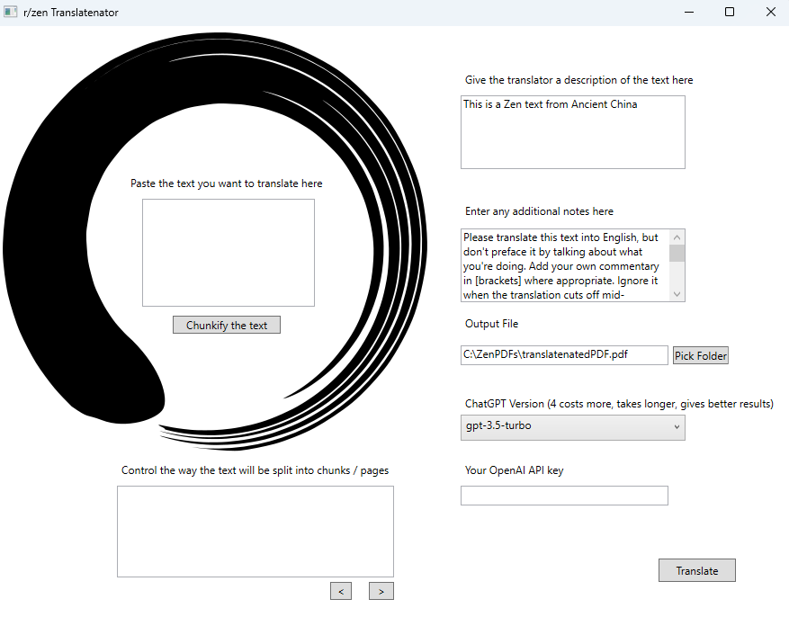

# ZenTranslatenator

It works for me. That's about all I can say. No error handling. It eats money. It's badly tested. You're on your own.

It is vital that you download this font: https://www.download-free-fonts.com/details/88978/arial-unicode-ms

Install it by double clicking it and installing it or by putting it into your C:\Windows\Fonts directory.

Screenshots to check out: 

